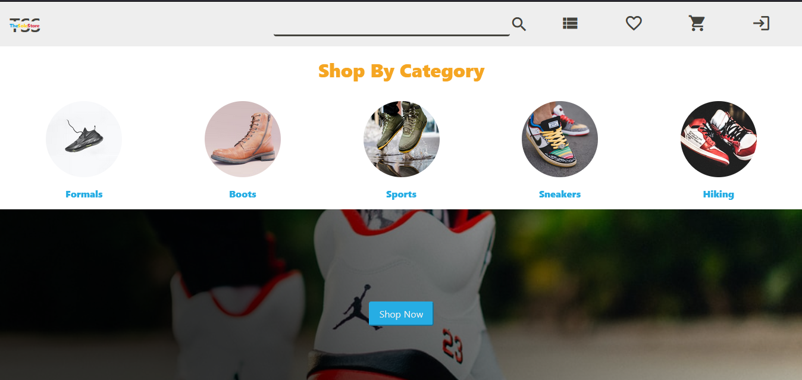

# TheSoleStore

### Disclaimer

The current application is still a WIP (work in progress) , but the intended functionalities added upto this point work in the intended manner.     
(Note : Do not refresh the page while using the website , as it is still a WIP and can braeak features , be patient!).      
At current stage pages with React JS along with HTML & CSS have been developed.     

### The project is live at
#### Vercel : https://thesolestoreapp-git-dev-hnh013.vercel.app/

## Contents

1. **[Project Title & description](#theSoleStore)**
2. **[Purpose of the project](#purpose-of-the-project)**
3. **[Technologies Used](#technologies-used)**
4. **[Motivations behind the project](#motivations-behind-the-project)**
5. **[Demo](#demo)**

## 1. The Sole Store
* The Sole Store is an e-commerce site focused on the sales of shoes of various kinds. 
* The application will offer its users to purchase from a wide variety of shoes available.   
* Users would be able to save their favorite items in wishlist, and add them to cart before buying.
* Users will be able to login , signup an logout of the application.

At this moment, current list of components/pages that are present in the application are :

1. Home Page [Link](https://thesolestoreapp-git-dev-hnh013.vercel.app/)
2. Products Page [Link](https://thesolestoreapp-git-dev-hnh013.vercel.app/products)
3. Wishlist Page [Protected Route , needs login] [Link](https://thesolestoreapp-git-dev-hnh013.vercel.app/wishlist)
4. Cart Page [Protected Route , needs login] [Link](https://thesolestoreapp-git-dev-hnh013.vercel.app/cart)
5. Login Page [Link](https://thesolestoreapp-git-dev-hnh013.vercel.app/login)
6. Signup Page [Link](https://thesolestoreapp-git-dev-hnh013.vercel.app/signup)

## 2. Purpose of the project
* The main aim of the project is to create a user-friendly, easily to navigate e-commerce website for the users where they can buys shoes of various kinds.
* the user should be able to add to navigate the landing page and see the categories of the products in the store.
* The user should be able to see the list of featured products on the landing page.
* The user should be able to see the list of products offered by the store.
* The user should be able to filter the products from the pre-decided categories such as type , price , rating , etc and also be able to sort them by price range.
* The user should be able to log in and out of the site , with notification (in form of toasts) giving the status of their persistence.
* The user should be able to signup , creating a new account if he/she doesn't possesses one.
* The user , if logged in , should be able to add or remove items form his/her cart , increas or decrease the quantity before checkout. 
* The user , if logged in , should be able to add or remove items from his/her wishlist and also be able to add them to cart later on.

## 3. Technologies Used
* At the current stage of development, HTML , CSS and ReactJS have been used in the project.

## 4. Motivations behind the project
* This project was built as part of my learning of ReactJS , HTML and CSS in neogcamp 2022.
* The project was created to create an e-commerce application fully dedicated to selling of shoes.

## 5. Demo

### The project is live at
#### Vercel : https://thesolestoreapp-git-dev-hnh013.vercel.app/

#### Home Page [Link](https://thesolestoreapp-git-dev-hnh013.vercel.app/)

#### Products Page [Link](https://thesolestoreapp-git-dev-hnh013.vercel.app/products)

#### Wishlist Page (protected route, needs login) [Link](https://thesolestoreapp-git-dev-hnh013.vercel.app/wishlist)

#### Cart Page (protected route, needs login) [Link](https://thesolestoreapp-git-dev-hnh013.vercel.app/cart)

#### Login Page [Link](https://thesolestoreapp-git-dev-hnh013.vercel.app/login)

#### Signup Page [Link](https://thesolestoreapp-git-dev-hnh013.vercel.app/signup)

[Back To Top](#top)
